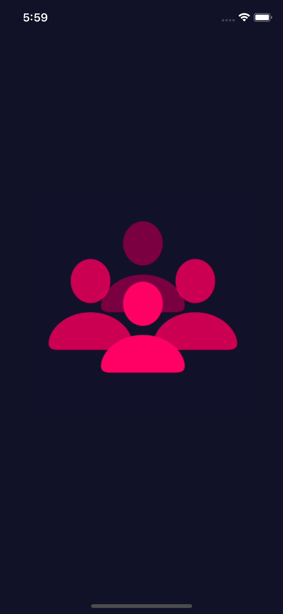
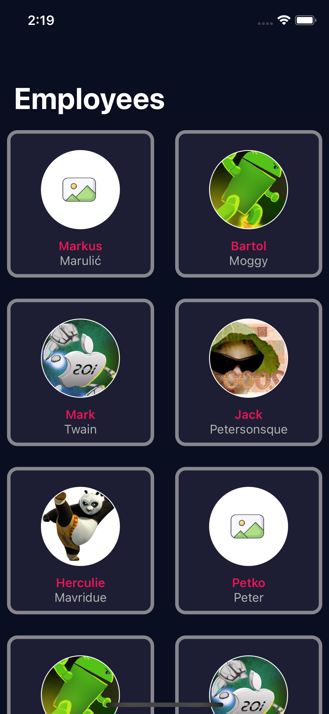
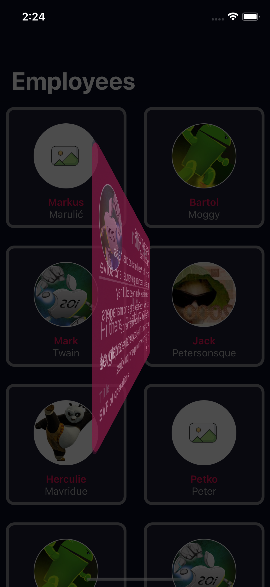
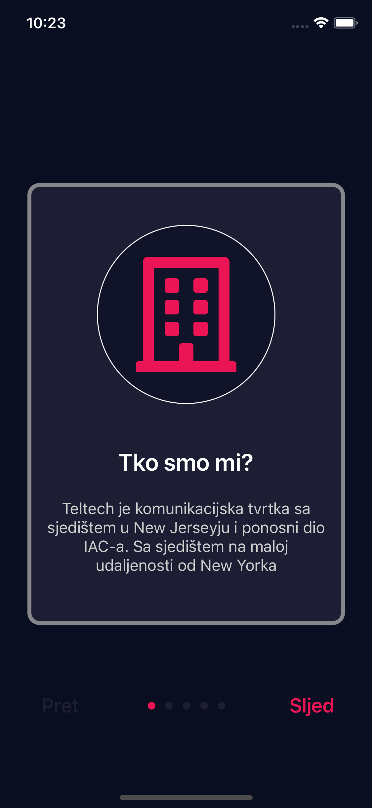
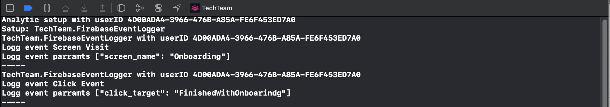

# TechTeam
TechTeam is a simple iOS application for showing employees. The employees are fetched from Teltech API for technical task #2.

# Installation
After cloning the project it is required to run pod install and run .xcworkspace.

# Tech stack
- min iOS 13
- Swift 5.3 
- Xcode 12.3
- MVVM+Rx
- UIKit/SwiftUI
- Pods:
  - RxSwift (v6.0)
  - RxCocoa (v6.0)
  
# Screens
The application screens:
- Splash
- Onboarding
- Employees
- Employee Details

## Splash Screen
When entering the application, firstly a small splash screen will show. When the launching icon gets minimized, in the middle will show a bouncing circle. 
Another filling circle is inside the middle circle which is animating filling the stroke as a circular shape. 
When the middle circle finished filling the circle, the transition animation is triggered. The transition animation expands to the whole screen and after that, it starts presenting the next screen.

   
  
 
## Onboarding Screen
After the splash transition finished, this screen will slide from the right to the left on the screen. Onboarding screen represents views as cards with data which is locally stored. The data represents questions/answers which can be read through scrolling the onboarding collection. Beside normal scrolling, user can navigate with bottom controls to the next/previous card. After getting to the last card a button will show on the screen. The button enables the user to enter next screen where he can see the list of employees.

   

## Employees Screen
After pressing the button on onboarding to explore employees list, another screen will slide in. The employees' screen uses custom transition and it will animate from the left to the right side of the screen. When the screen is focused, automatically will a fetch request start. If the data is not available because of poor internet an alert dialog will appear on the screen. Beside alert dialog, the collection will present a header cell which informs the user to activate pull down on the screen to hit again the fetch request. If everything goes well the screen will populate with employees. To see more details of each employee, it is required to select one cell. After selecting a cell, automatically will be triggered another transition to the details screen.

   
  
 

## Employee Details Screen
This screen will show after selecting one of the employees. The transition is starting from top to bottom of the screen with a spring effect. After it settles down the user can read more about of the employee with data presented on a card. To see more description about the employee, a click is required on the card. When tapping, a rotating animation will be triggered and the backside of the card will be shown. To remove the card from the screen it is required to tap outside of the card. The transition to employees screen will reverse the entering animation of the card.

   
   
 

# Extra
## Multilanguage support 
This application supports English for its base language and Croatian. The files for localization can be found inside supporting files, under the localization folder. After selecting localizable.strings, it will show the two supported files (English/Croatian). The files have key/values. which keys are used throughout the application inside NSLocalizedString. On the next images, some key/values are shown for localization. For supporting localization of Employee detials it is required to add param at the ednpoint for sending which localization is required.

   
  
 
### Testing multilanguage support
For easy testing on simulator just edit the schema of the current project (it can be found on the right side of the stop button). Changing the App language to Croatian will automatically set while running next time on the simulator to translate application to Croatian. On the images, it can be seen on the onboarding screens.

  
 

## Usage of SwiftUI
While manly of the app was build with UIKit, the employees' description screen is constructed with the usage of SwiftUI. For supporting this view it was required to pack it as rootViewController inside UIHostingController.

 

## Unit tests
While this filed is still a bit new for me I did try it. In this testing, I did test some base stuff of OnboardingViewModel and EmployeeViewModel.
On the images, it is shown how to fail and how to pass on the OnboardingViewModel testing. For instance, let's take function test_onboardingListViewModelCount, it is testing if the init of ViewModel did go good. In this testing, it should be 2 but for failing I did set 4.
 
  

## Service for event tracking
Inside the Service folder is Analytics folder which consists of files to log events and send to specific Analytics SDK's. To create EventName navigate to Events.swift and add event name which you want to monitor. For this testing, I decided to put screenVist and clickEvent.

```swift
enum EventName {
    static let screenVisit = "Screen Visit"
    static let clickEvent = "Click Event"
}
```

For tracking specific features it is required to open EventFeatures.swift. Here I defined one feature, entering onboarding screen and clicking to leave onboarding and start the transition to employees screen. 

```swift
// FeatureOne
enum FeatureOneEvents {
    @Event(screenValue: "Onboarding")
    static var screen: Event

    @Event(clickValue: "FinishedWithOnboarindg")
    static var buttonClick: Event
}
```

For adding numerous Analytics SDK's and their setup we need to navigate to AnalyticsManager. For testing purpose I did setup Firebase class which would fire FirebaseAnalytics after firing trackEvent()


```swift
// Firebase
class FirebaseEventLogger: AnalyticsEventsLoggerProtocol {
    var user: UserProfileModel?
        
    // set user properties
    func setUserProperties(user: UserProfileModel) {
        self.user = user
        
        if loggerDebugEnabled {
            print("Setup: \(self)")
        }
    }
    
    // add implementation of tracking events
    func trackEvent(event: EventProtocol) {
        guard let user = user else { return }
        
        if loggerDebugEnabled {
            print("\(self) with userID \(user.userID)")
            print("Logg event \(event.name)")
            print("Logg event parramts \(event.params)")
            print("-----")
        }
    }
}
```

For managing all SDK's setups and firing events.

```swift
class AnalyticsManager {
    
    static let shared = AnalyticsManager()
    
    private var loggers: [AnalyticsEventsLoggerProtocol] = []

    // Setup all the Analytics SDK's
    func setUp() {
        let user = UserProfileModel(userID: UUID().uuidString)
        print("Analytic setup with userID \(user.userID)")

        let firebaseEventLogger = FirebaseEventLogger()
        firebaseEventLogger.setUserProperties(user: user)
        
        loggers.append(firebaseEventLogger)
    }
    
    func trackEvent(_ event: EventProtocol, params: [String: Any] = [:]) {
        loggers.forEach({ logger in
            logger.trackEvent(event: event)
        })
    }
}
```

For testing purpose, it is required to firstly init AnalyticsManager, the best situation would be at the start of the application. After that, I did add event trigger on entering onboarding and leaving onboarding screen. The event triggers can take extra parameters and can be empty.
       

```swift

// AppDelegate 
AnalyticsManager.shared.setUp()

// Onboarding Screen viewDidLoad
AnalyticsManager.shared.trackEvent(FeatureOneEvents.screen)

// Onboarding Screen handle click on button and leaving screen
AnalyticsManager.shared.trackEvent(FeatureOneEvents.buttonClick,
                                  params:["extraKey": "extraValue"])
```

### Logged events
On the next image, the logged events are shown. From init to trigger events.
 
