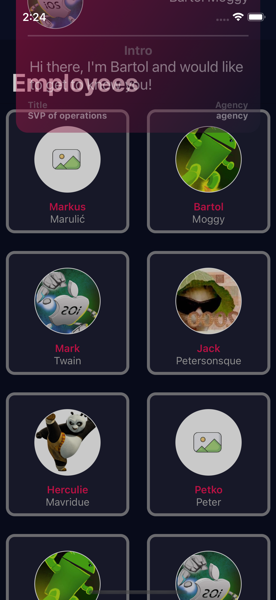

# TechTeam
TechTeam is a simple iOS application for showing employees. The employees are fetched from Teltech API for technical task #2.

# Installation
After cloing the project it is required to run pod install and run .xcworkspace.

# Tech stack
- Swift 5 
- Xcode 12
- MVVM+Rx
- UIKit/SwiftUI
- Pods:
  - RxSwift (v6.0)
  - RxCocoa (v6.0)
  
# Screens
The application screens:
- Splash
- Onboarding
- Employees
- Employee Details

## Splash Screen
When entering application, firstly a small splash screen will show. When the launching icon gets minimized, in the middle will show a bouncing circle. 
Another filling circle is inside the middle circle which is animating filling the stroke as circular shape. 
When the middle circle finished filling the cirlce, the transition animation is triggered. The transition animation expands to the whole screen and after that it starts presenting next screen.

   
  
 
## Onboarding Screen
After splash transition finished, this screen will slide from the right to the left on the screen. Onboarding screen represents views as cards with data which is localy stored. The data represents questions/answers which can be read trought circuling the onboarding collection. Beside normal scrolling, user can navigate with bottom controlls to the next/previous card. After getting to the last card a button will show on the screen. The button enables user to enter next screen where he can see the list of employees.

   

## Employees Screen
After pressing button on onboarding to explore employees list, another screen will slide in. The onboarding screen uses custom transition and it will animate from the left to the right side of screen. When the screen is focused, automatically will a fetch request start. If the data is not available because of poor internet a alert dialog will apear on the screen. Beside alert dialog, the collection will present header cell which informs user to activate pull down on the screen to hit again the fetch request. If everything goes well the screen will populate with employees. To see more details of each employee, it is required to select one cell. After selecting cell, automatically will be trigered another transition to the details screen.

   
  
 

## Employee Details Screen
This screen will show after selecting one of the employees. The transition is starting from top to bottom with spring effect. After is settles down the user can read more about of the employee with data presented on a card. To se more description about the user, a click is required on the card. When tapping, a rotating animation will be trigered and the back side of the card will be shown. To remove the card from screen it is requreid to tap outside of the card. The transition to employees screen will reverse the entering nimation of the card.

   
   
 

